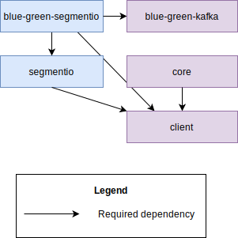

# MaaS go client
Go client to preform operations with MaaS

<!-- TOC -->
* [MaaS go client](#maas-go-client)
  * [Kafka](#kafka)
    * [MaaS Kafka client API](#maas-kafka-client-api)
    * [Get/Create/Delete topic from non default kafka instance](#getcreatedelete-topic-from-non-default-kafka-instance)
    * [Create MaaS Kafka go client with Cloud-Core default configuration](#create-maas-kafka-go-client-with-cloud-core-default-configuration)
    * [Use MaaS Kafka client with https://github.com/segmentio/kafka-go](#use-maas-kafka-client-with-httpsgithubcomsegmentiokafka-go)
    * [Implement messages consumption from Kafka topic in Blue-Green scenarios with https://github.com/segmentio/kafka-go](#implement-messages-consumption-from-kafka-topic-in-blue-green-scenarios-with-httpsgithubcomsegmentiokafka-go)
    * [Libraries dependency graph:](#libraries-dependency-graph)
  * [Rabbit](#rabbit)
    * [MaaS Rabbit client API](#maas-rabbit-client-api)
    * [Create MaaS Rabbit go client with Cloud-Core default configuration](#create-maas-rabbit-go-client-with-cloud-core-default-configuration)
<!-- TOC -->

## Kafka
MaaS Kafka client to preform MaaS operations related to Kafka

### MaaS Kafka client API
[see API documentation](./kafka/api.go)

### Get/Create/Delete topic from non default kafka instance
Use 'Instance designators' feature in MaaS to control which kafka instance should be used. See this [documentation](https://github.com/netcracker/maas/blob/main/README.md#instance-designators)

### Create MaaS Kafka go client with Cloud-Core default configuration
To create MaaS kafka go client with Cloud-Core defaults use the following library extension
[libs/go/maas/core](https://github.com/netcracker/qubership-core-lib-go-maas-core)

### Use MaaS Kafka client with https://github.com/segmentio/kafka-go
To create pre-configured segmentio/kafka-go reader/writer/client structs via MaaS use the following extension
[libs/go/maas/segmentio](https://github.com/netcracker/qubership-core-lib-go-maas-segmentio)

### Implement messages consumption from Kafka topic in Blue-Green scenarios with https://github.com/segmentio/kafka-go
To create Blue-Green aware Kafka consumer use the following extension
[libs/go/maas/blue-green-segmentio](https://github.com/netcracker/qubership-core-lib-go-maas-bg-segmentio)

### Libraries dependency graph:

## Rabbit
MaaS Rabbit client to preform MaaS operations related to Rabbit

### MaaS Rabbit client API
[see API documentation](./rabbit/api.go)

### Create MaaS Rabbit go client with Cloud-Core default configuration
To create MaaS rabbit go client with Cloud-Core defaults use the following library extension
[libs/go/maas/core](https://github.com/netcracker/qubership-core-lib-go-maas-core)
